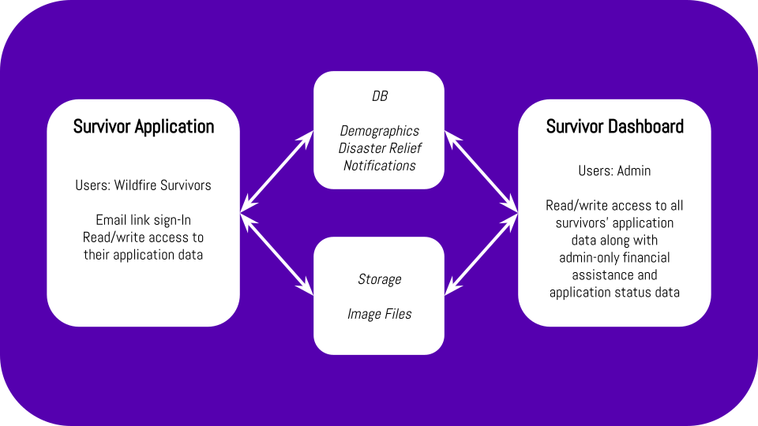

# Wildfire Survivor Management System

This is the development repository for two apps (Survivor Application and Survivor Dashboard) which together create the Wildfire Survivor Management System (WSMS).

## Origin Story

@AlenaNV, @cmatthey and I met each other at an IBM Call for Code Hackathon and submitted a <a href="https://docs.google.com/presentation/d/1d_3tq-1y3BTtaHsHbbBHTFACioDKjJyVuCnjy360n_4/edit?usp=sharing">Proof Of Concept</a> after working with the Development Director from United Way (Northern California). He and his team were interested in moving forward so we did! @AlenaNV has created <a href="https://sketch.cloud/s/8Az7w">the Sketch files at this link</a> from the requirements we have gathered since then. I've been working on getting the MVP together. 

## Project Roadmap

- [x] Initial Kickoff + Gather Requirements
- [x] Initial Sketches (<a href="https://sketch.cloud/s/8Az7w">Sketch files</a>)
- [ ] Initial (Development) Survivor Application
- [ ] Initial (Development) Survivor Dashboard
- [ ] Initial (Production) Release for Survivor Application
- [ ] Initial (Production) Release for Survivor Dashboard

## Project Overview

The project is split into two apps: a Survivor Application and a Survivor Dashboard. Each user will have an account for their Survivor Application and each staff/admin will have an account for the Survivor Dashboard, which shows all users' Survivor Application data along with some internal admin-related data (financial assistance details, application status, etc.)

## Survivor Application

### Core Functionality

- Allows users (wildfire survivors) to :
  - Create an account (Email link sign-in is preferred method)
  - Fill out, preview and submit an application
  - Modify their application data
  - View the status of their application
  
## Survivor Dashboard

### Core Functionality:

- Allows users (staff members) to:
  - View and update demographic information
  - View and update application status
  - View and update financial assistance data
 

 
## Installation

1. Download the repo
2. Navigate to the `CallForCode` directory
3. `npm install` inside the `CallForCode` directory
4. `npm start` will start the development server on `localhost:3000`
5. `npm run cypress:open` will run the cypress integration tests

## Contribute!

Please! We need all the help we can get to reach the MVP efficiently, effectively and enjoyably.

0. Join our Slack channel (<a href="https://join.slack.com/t/wsms-contributors/shared_invite/enQtNzI2Mjk5MDM2Mzg0LTUyYWYwMjNiN2U3MTJlMDhhYmFlNWNlOGQ4ZWJkYWE0MTAzZjU0MjYzYzkxNWExNDMxMjViZWNhY2MxZmZkODE">invite link</a>).

1. Meeting minutes from review calls with the United Way contacts will be located in <a href="https://drive.google.com/drive/folders/10XQV-3Z71ZYGFno3BFoPAunxVdZGDOM5?usp=sharing">this folder</a>.

2. Please review the <a href="./docs">project documentation</a>. This will help you understand the motivation behind the existing code and areas of improvement (there are many areas of improvement).

3. Please see our <a href="docs/CONTRIBUTING.md">Contributing</a> guide

